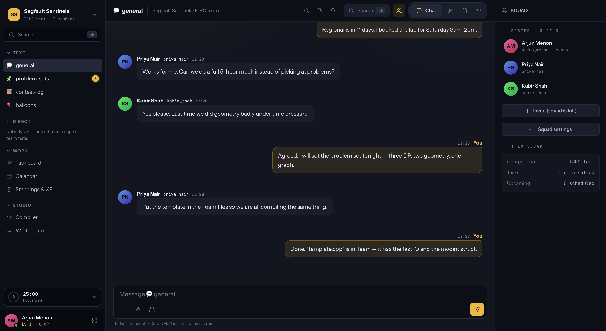
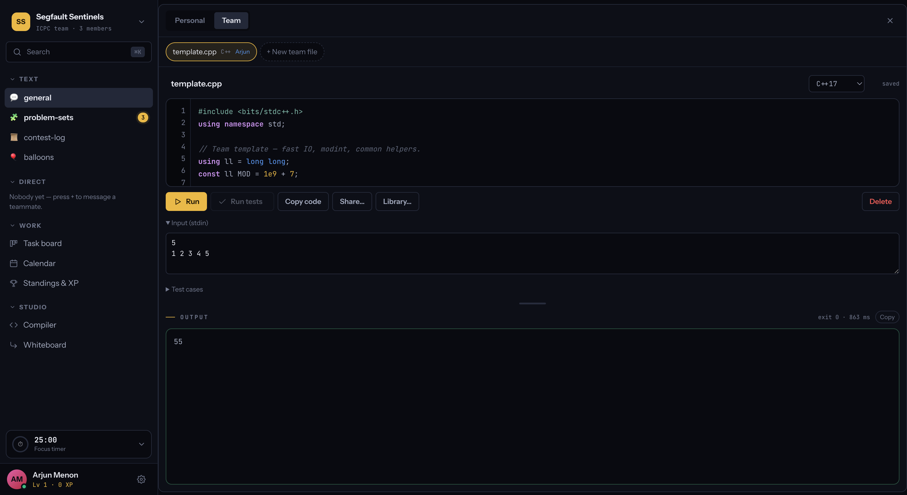
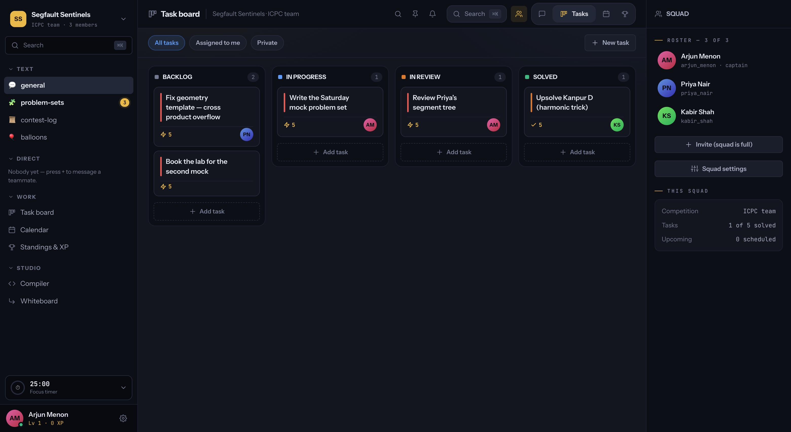
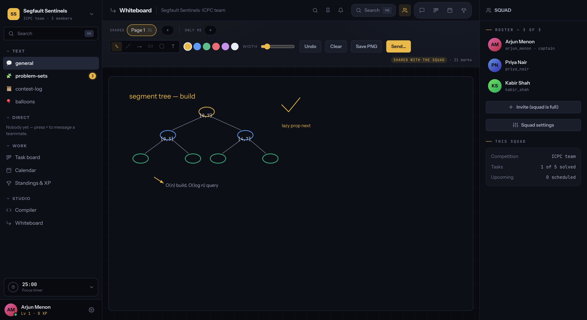

<div align="center">

# Squadron

**A workspace for CS squads — the ones that form for ICPC, GSoC, a hackathon, or a
study group, and usually die in a group chat three weeks later.**

Channels, DMs, file sharing, a sandboxed C++/Python compiler, a task board with real
XP, a shared whiteboard, and browser-to-browser video meetings — in one place, scoped
to the team rather than to you.

[squadron.nishanthrao.com](https://squadron.nishanthrao.com)



</div>

---

## Why

A squad forms, makes a group chat, and scatters its work across five tools. The
problem set is in someone's DMs, the code is in a paste that expired, the meeting
link is three hundred messages up, and nobody knows who is doing what. Six weeks
later the team is dead and nobody can say exactly when it died.

Squadron puts the work in the same place as the conversation.

## What's in it

| | |
|---|---|
| **Channels** | per squad, with unread counts, threads, reactions, pins, mentions, voice notes |
| **Direct messages** | one-to-one, with read receipts and typing indicators |
| **Attachments** | drag, paste or pick — images, video, audio, PDFs, anything up to 25 MB |
| **Compiler** | C++ and Python, run in a real sandbox, with stdin and saved test cases |
| **Task board** | drag or keyboard, flat 5 XP a task, private tasks nobody else can see |
| **Whiteboard** | shapes, text, pages, shared or private, exportable |
| **Meetings** | WebRTC video and screen share, joinable by link without joining the squad |
| **XP and standings** | earned only from work the squad can actually see |
| **Calendar** | with a reminder ten minutes before anything starts |

### Code runs where the conversation is

C++ and Python execute in a real sandbox — no network, a read-only toolchain, one
writable directory — with stdin and saved test cases. Team files are shared with the
squad; personal ones are yours.



### A board that pays for finished work

Flat 5 XP a task, awarded only when it lands in Solved, and only for work the squad
can actually see. Private tasks stay off everyone else's board and pay nothing.



### A whiteboard for the thing you cannot explain in text

Shapes, arrows, text and pages — shared with the squad, or private to you.



## How it's built

Deliberately small. One Node process, **one npm dependency**, and a single SQLite
file on disk.

```
Node 22+          runtime, using the built-in node:sqlite
ws                the only dependency — WebSockets for chat, presence and WebRTC signalling
SQLite            25 tables, WAL mode, no external database
vanilla JS        no framework, no build step, no bundler
```

```
server/     3,093 lines, 81 routes across 9 files
public/     the entire client — one HTML file, one CSS file, one JS module
```

No React, no Postgres, no Redis, no message broker, no Docker required to develop.
`git clone && npm install && npm run dev` and it runs.

## Security

Everything here was verified against a running server, not assumed.

- **Passwords** are scrypt-hashed and never retrievable — there is no route that
  returns one, by design
- **Session tokens** are stored as SHA-256 hashes, so a stolen copy of the database
  yields nothing usable as a cookie
- **Code execution** is sandboxed — `sandbox-exec` on macOS, `bubblewrap` on Linux —
  with no network, a read-only toolchain, and one writable scratch directory. If no
  sandbox is available it **refuses to run rather than running unprotected**
- **Attachments** are served `application/octet-stream` with `nosniff` and a
  sandboxed CSP unless they are a vetted media type, so an uploaded HTML or SVG file
  cannot execute against the origin
- **Headers**: CSP with no `script-src 'unsafe-inline'`, `frame-ancestors 'none'`,
  HSTS, `nosniff`, `Referrer-Policy`
- **Private data** — private tasks, private whiteboard pages — answers `404` rather
  than `403`, so it does not confirm that it exists

## Running it

```bash
npm install
npm start          # https on :4173, self-signed — camera and mic need a secure context
npm run dev:http   # plain http, if you do not need media
```

Then open <https://localhost:4173>.

To let someone else in from another machine, `npm run tunnel` puts it behind a
Cloudflare tunnel with a real certificate — a browser will not grant camera or
microphone access over plain http.

## Deploying

See [DEPLOY.md](DEPLOY.md). The short version: any Linux box with a domain. There is
a `Dockerfile`, and `npm run deploy` pushes to a configured host — backing up the
database first, then restarting and verifying the site answers.

It needs a real server rather than serverless hosting: the process is long-lived, it
holds WebSocket connections open, and it writes to a disk it expects to still be
there next time.

## Licence

MIT
